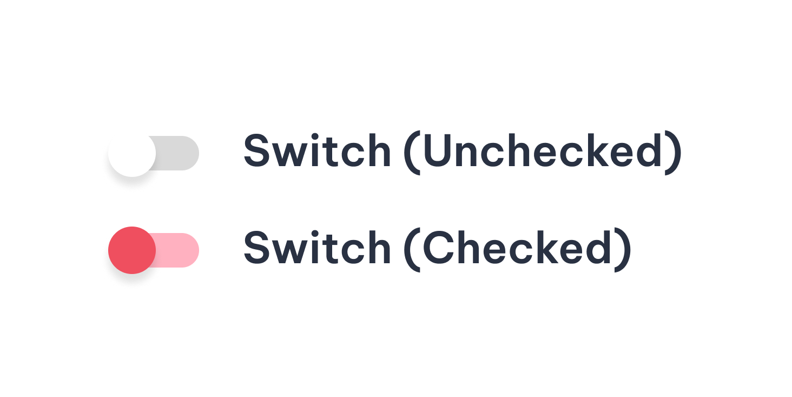
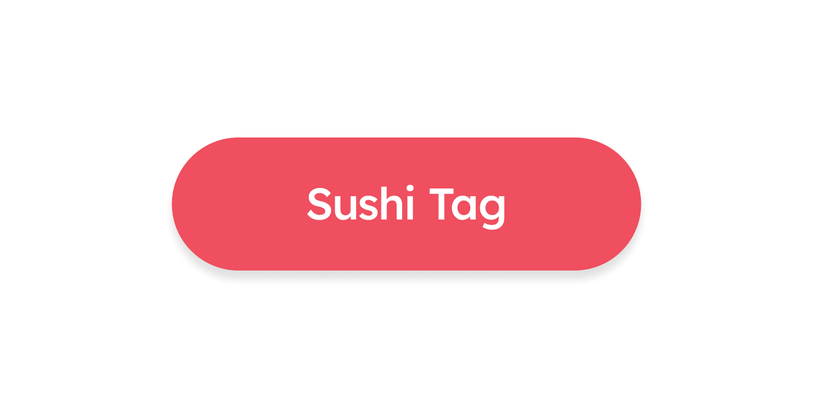
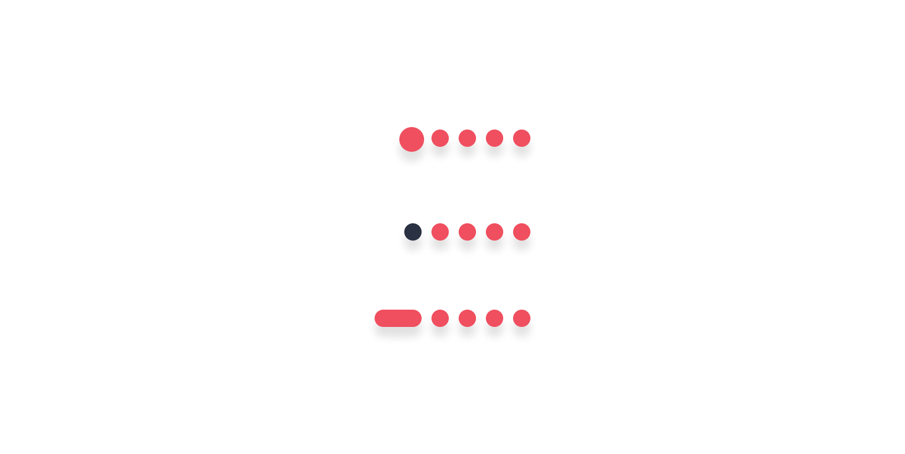

--- 
hide: -navigation -toc 
---

# Welcome to Sushi
Sushi is a sleek, modular Compose UI design system powering consistent user experiences across Zomato and its family of brands.

Currently available for 🤖 Android.

Will soon be available for 🖥️ Desktop, 🌐 Web (Js/WASM), 🍎 iOS, and any other platform Compose can run on.

_**Note: Currently Sushi is in alpha stage. APIs are subjected to change.**_ 

## Getting Started
For introduction and basic setup, click [here](introduction.md).
## Components

    

        
        
SushiText

    

    

            
            
SushiIcon

    

    

            
            
SushiButton

    

    

            
            
SushiImage

    

    

            
            
SushiCheckBox

    

    

            
            
SushiRadioButton

    

    

            
            
SushiSwitch

    

    

            
            
SushiTag

    

    

            
            
SushiTextField

    

    

            
            
SushiAnimation

    

    

            
            
SushiLoader

    

    

            
            
SushiCard

    

    

            
            
SushiIndicators

    

    

            
            
SushiDivider

    

    

            
            
SushiShimmer

    

    

            
            
SushiSnackbar

    

    

            
            
SushiBottomSheet

    

    

            
            
SushiDialog

    

    

            
            
SushiDropDown

    

    

            
            
SushiMedia

    

    

            
            
SushiOTPInput

    

    

            
            
SushiHorizontalPager

    

    

            
            
SushiVerticalPager

    

    

            
            
SushiRatingBar

    

    

            
            
SushiTooltip

    

    

            
            
SushiViewFlipper

    

 
# Special Thanks
- Thanks to [Compose Material](https://developer.android.com/jetpack/androidx/releases/compose-material) upon which this library is based.
- Thanks to [Lumo UI](https://github.com/nomanr/lumo-ui) for implementation references.
- Thanks to [Compose Unstyled](https://github.com/composablehorizons/compose-unstyled) and [Material for MkDocs](https://squidfunk.github.io/mkdocs-material/) for the documentation site.