--- 
hide: -navigation -toc 
---

# Build better with Sushi
Sushi is a sleek, modular Compose UI design system powering consistent user experiences across Zomato and its family of brands. Sushi brings you a fresh, reusable UI experience - designed to roll beautifully across Android. Support for iOS, Desktop, Web, and more coming soon.

Sushi is ready for general use, but the API is considered unstable as we continue to iterate on it.

## Getting Started
For introduction and basic setup, click [here](introduction.md).
## Components

    

        
        
SushiText

    

    

            <a href="sushiicon">
              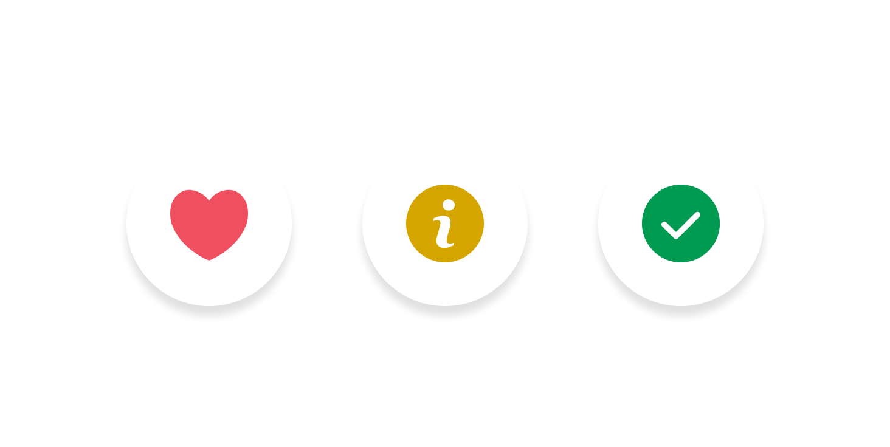
            </a>
            
SushiIcon

    

    

            <a href="sushibutton">
              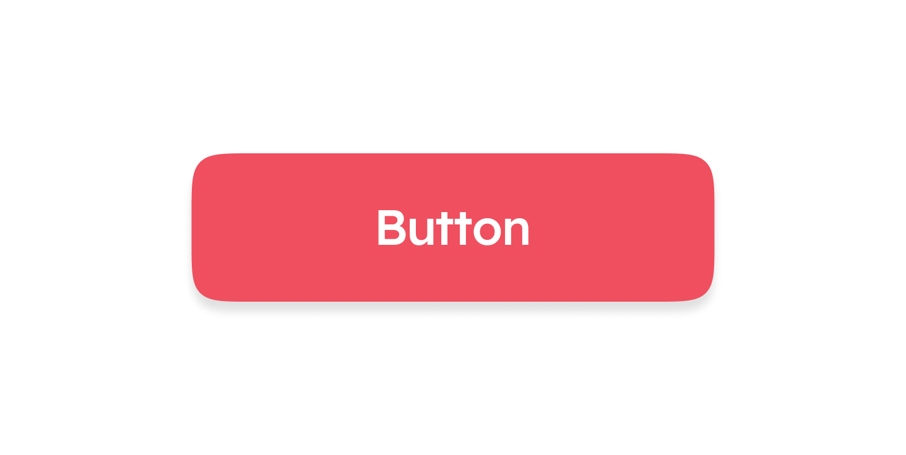
            </a>
            
SushiButton

    

    

            
            
SushiImage

    

    

            
            
SushiCheckBox

    

    

            
            
SushiRadioButton

    

    

            
            
SushiSwitch

    

    

            
            
SushiTag

    

    

            <a href="sushitextfield">
              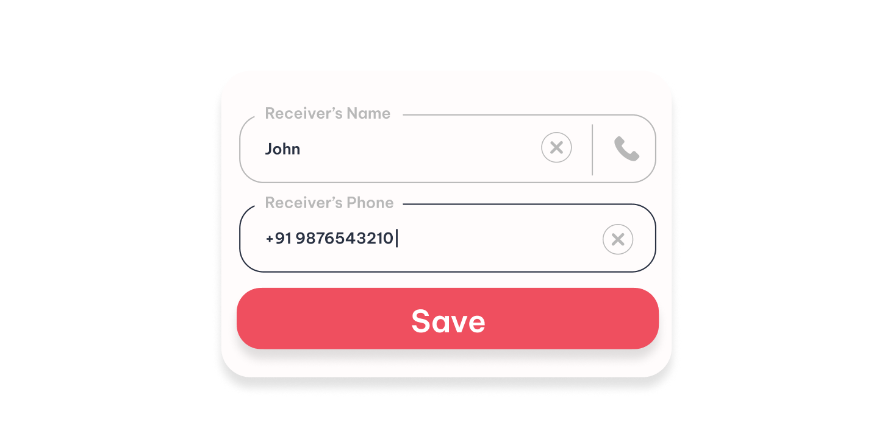
            </a>
            
SushiTextField

    

    

            
            
SushiAnimation

    

    

            
            
SushiLoader

    

    

            <a href="sushicard">
              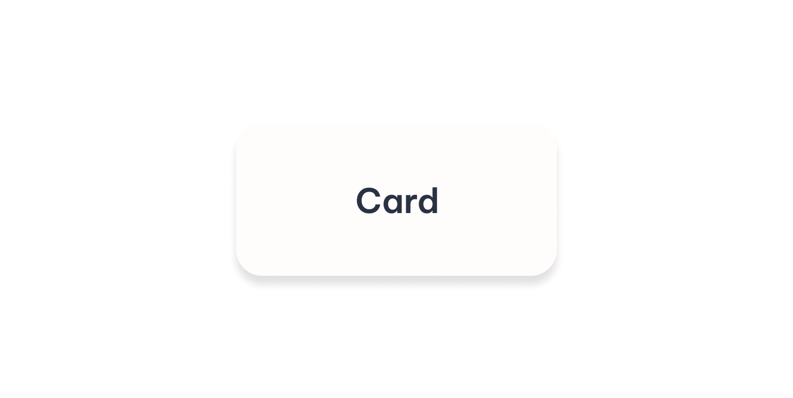
            </a>
            
SushiCard

    

    

            
            
SushiIndicators

    

    

            <a href="sushidivider">
              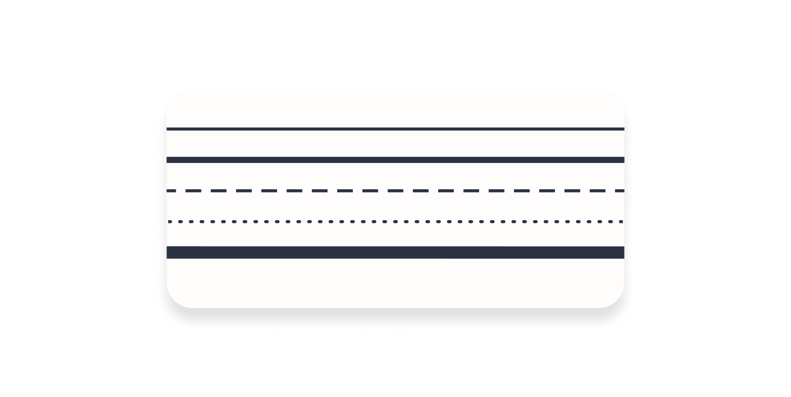
            </a>
            
SushiDivider

    

    

            
            
SushiShimmer

    

    

            <a href="sushisnackbar">
              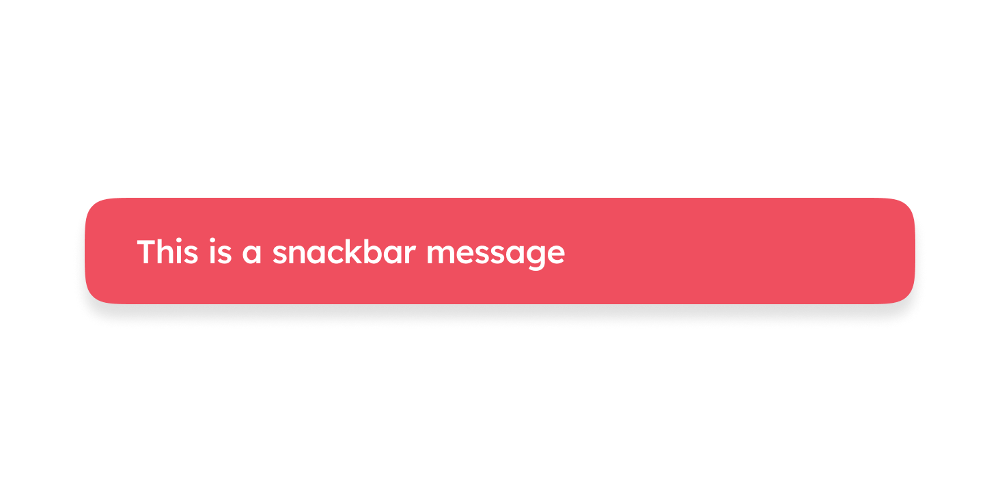
            </a>
            
SushiSnackbar

    

    

            <a href="sushibottomsheet">
              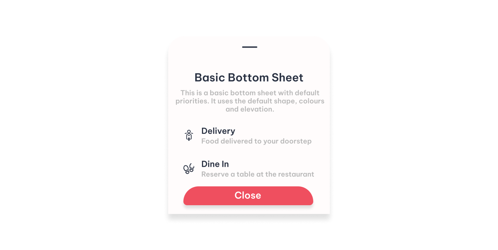
            </a>
            
SushiBottomSheet

    

    

            
            
SushiDialog

    

    

            <a href="sushidropdown">
              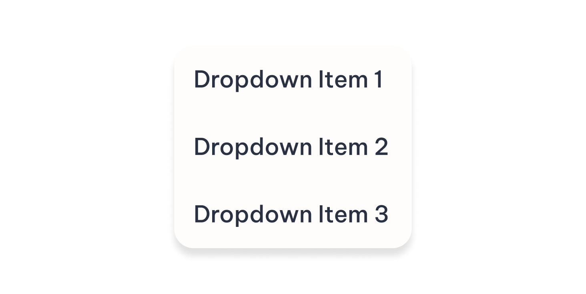
            </a>
            
SushiDropDown

    

    

            
            
SushiMedia

    

    

            
            
SushiOTPInput

    

    

            <a href="sushihorizontalpager">
              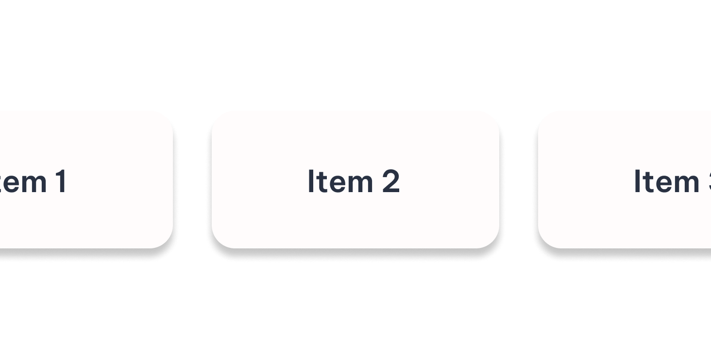
            </a>
            
SushiHorizontalPager

    

    

            <a href="sushiverticalpager">
              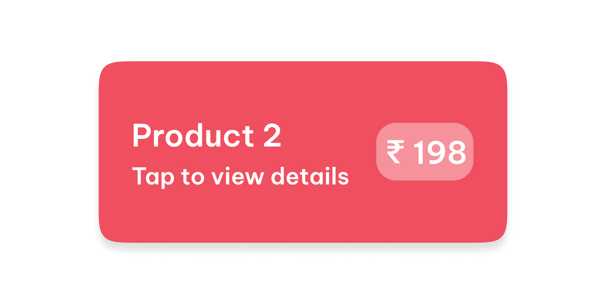
            </a>
            
SushiVerticalPager

    

    

            
            
SushiRatingBar

    

    

            
            
SushiTooltip

    

    

            <a href="sushiviewflipper">
              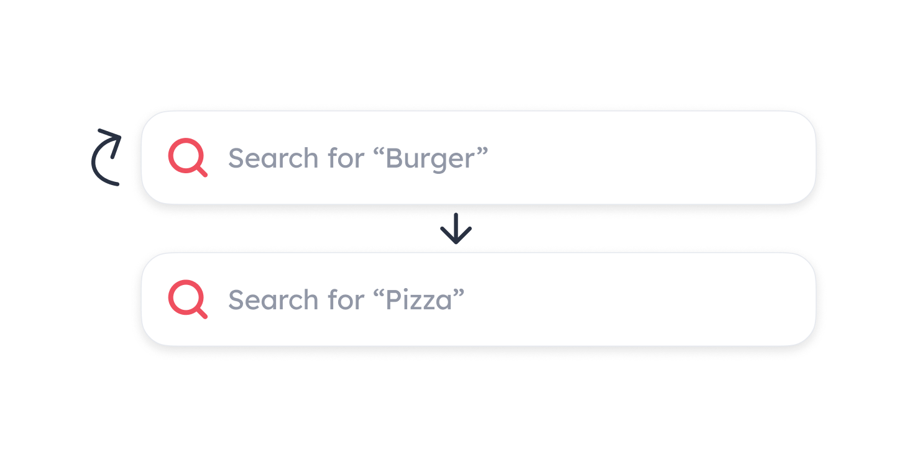
            </a>
            
SushiViewFlipper

    

 
# Special Thanks
- Thanks to [Compose Material](https://developer.android.com/jetpack/androidx/releases/compose-material) upon which this library is based.
- Thanks to [Lumo UI](https://github.com/nomanr/lumo-ui) for implementation references.
- Thanks to [Compose Unstyled](https://github.com/composablehorizons/compose-unstyled) and [Material for MkDocs](https://squidfunk.github.io/mkdocs-material/) for the documentation site.